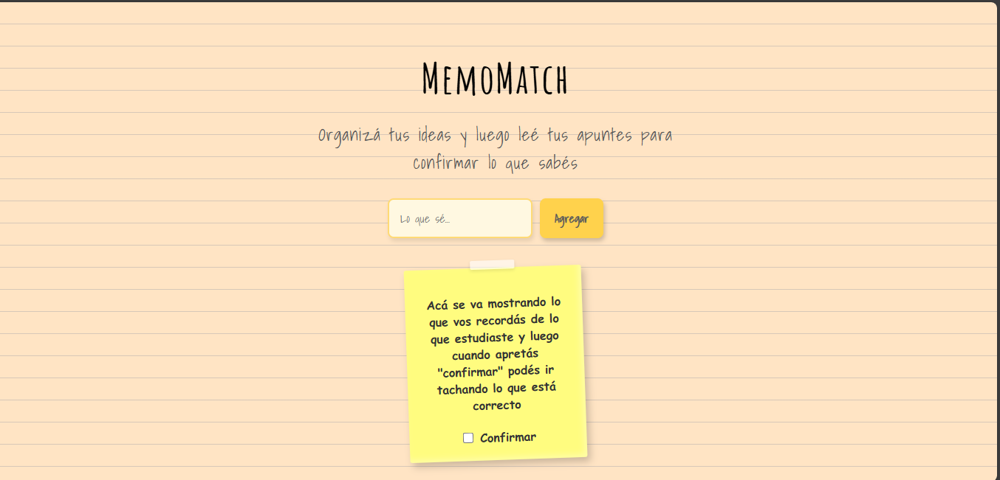

# 🧠 MemoMatch

MemoMatch es una aplicación web para escribir lo que recordás de tus apuntes y cotejarlo después. Cada idea que escribís se muestra como un post-it visual que podés confirmar al repasarlo.

## 📸 Captura de pantalla

## ✨ Funcionalidades

- Ingreso de ideas mediante formulario
- Visualización con estilo post-it animado
- Confirmación y tachado de ideas repasadas
- Diseño cálido tipo hoja rayada